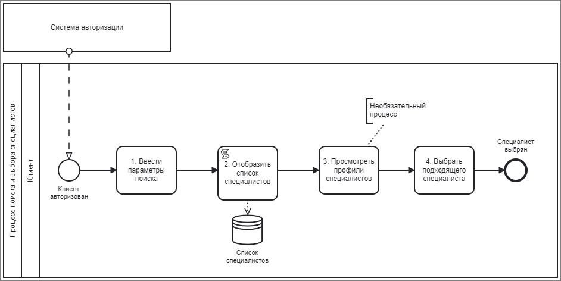

# Процесс поиска и выбора специалистов
## Общее описание
Процесс поиска и выбора специалистов предназначен для помощи клиентам в нахождении и выборе подходящего мастера из сферы красоты. В рамках этого процесса клиент выполняет различные действия для ввода параметров поиска, просмотра списка специалистов и выбора нужного мастера.

_Рисунок 1. Схема процесса поиска и выбора специалистов_

_Таблица 1. Шаги процесса поиска и выбора специалистов_

| № | Шаг процесса                      | Входная информация               | Выходная информация                                  | Исполнители | Интерфейс              |
|---|-----------------------------------|----------------------------------|-------------------------------------------------------|-------------|------------------------|
| 1 | Ввести параметры поиска           | Параметры поиска (район, услуга) | Список специалистов, удовлетворяющих критериям      | Клиент      | Клиентское приложение  |
| 2 | Отобразить список специалистов    | Список специалистов              | Визуальное представление списка специалистов         | Система     | Клиентское приложение  |
| 3 | Просмотреть профили специалистов | Выбранный специалист             | Подробная информация о специалисте (отзывы, рейтинг) | Клиент      | Клиентское приложение  |
| 4 | Выбрать подходящего специалиста  | Просмотренный специалист         | Подтверждение выбора специалиста                      | Клиент      | Клиентское приложение  |

_Таблица 2. Описание шагов процесса поиска и выбора специалистов_

| № | Шаг процесса                      | Описание                                                                                                                                                   |
|---|-----------------------------------|------------------------------------------------------------------------------------------------------------------------------------------------------------|
| 1 | Ввести параметры поиска           | Клиент вводит параметры поиска, такие как район, вид услуги и другие критерии поиска.                                                                     |
| 2 | Отобразить список специалистов    | Система отображает список специалистов, соответствующих введенным параметрам поиска.                                                                     |
| 3 | Просмотреть профили специалистов | Клиент выбирает специалиста из списка и просматривает его профиль, включая отзывы, рейтинг и цены на услуги.                                                |
| 4 | Выбрать подходящего специалиста  | Клиент выбирает подходящего специалиста и подтверждает свой выбор для записи на услугу.                                                                 |
