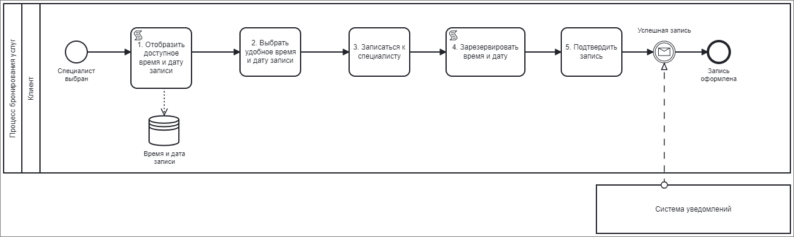

# Процесс бронирования услуг
## Общее описание
Процесс бронирования услуг предназначен для помощи клиентам в выборе и записи к специалисту из сферы красоты. В рамках этого процесса клиент осуществляет поиск доступного времени и даты для записи, выбирает удобное время, затем подтверждает свою запись.

_Рисунок 1. Схема процесса бронирования услуг_!

_Таблица 1. Шаги процесса бронирования услуг_

| № | Шаг процесса                          | Входная информация                 | Выходная информация                                     | Исполнители | Интерфейс              |
|---|---------------------------------------|------------------------------------|----------------------------------------------------------|-------------|------------------------|
| 1 | Отобразить доступное время и дату      | Выбранный специалист  | Список доступных дат и времени для записи к специалисту   | Система     | Клиентское приложение  |
| 2 | Выбрать удобное время и дату записи   | Доступные даты и время             | Выбранное клиентом время и дата для записи               | Клиент      | Клиентское приложение  |
| 3 | Записаться к специалисту              | Выбранный специалист, время и дата | Запись клиента на выбранное время и дату                 | Клиент      | Клиентское приложение  |
| 4 | Зарезервировать время и дату          | Выбранный специалист, время и дата | Резервирование времени и даты для выбранного специалиста | Система     | База данных, сервер    |
| 5 | Подтвердить запись                    | Зарезервированное время и дата     | Уведомление клиенту об успешной записи                   | Клиент      | Клиентское приложение  |

_Таблица 2. Описание шагов процесса бронирования услуг_

| № | Шаг процесса                          | Описание                                                                                              |
|---|---------------------------------------|-------------------------------------------------------------------------------------------------------|
| 1 | Отобразить доступное время и дату      | Система отображает доступные даты и время для записи к специалисту, учитывая район и вид услуги.     |
| 2 | Выбрать удобное время и дату записи   | Клиент выбирает удобные дату и время из представленных вариантов.                                      |
| 3 | Записаться к специалисту              | Клиент выбирает конкретного специалиста и подтверждает свою запись на выбранное время и дату.         |
| 4 | Зарезервировать время и дату          | Система резервирует выбранное клиентом время и дату для указанного специалиста.                       |
| 5 | Подтвердить запись                    | После успешного резервирования времени и даты клиент подтверждает свою запись.                       |
