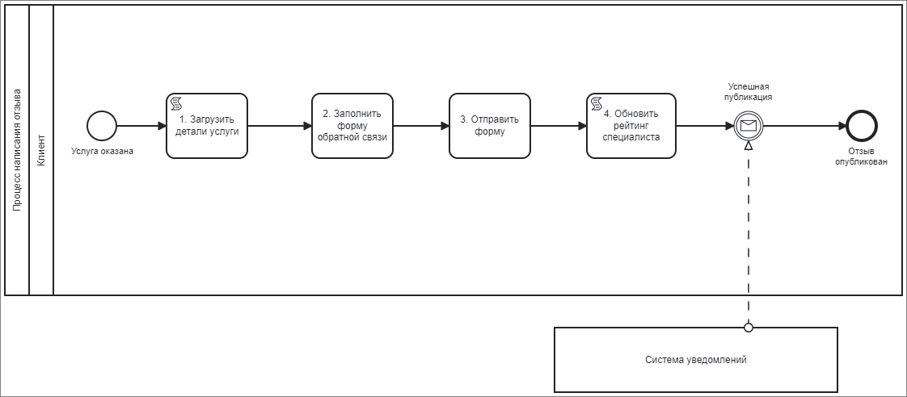

# Процесс написания отзыва
## Общее описание
Процесс написания отзыва предназначен для клиентов, желающих оставить свое мнение о полученной услуге от специалиста. В рамках этого процесса клиент загружает детали о предоставленной услуге, заполняет форму обратной связи с текстом отзыва и оценкой, отправляет форму для обновления рейтинга специалиста системой.

_Рисунок 1. Схема процесса _

_Таблица 1. Шаги процесса написания отзыва_

| № | Шаг процесса                      | Входная информация                     | Выходная информация                                | Исполнители | Интерфейс              |
|---|-----------------------------------|---------------------------------------|-----------------------------------------------------|-------------|------------------------|
| 1 | Загрузить детали услуги           | Детали услуги (название, дата, специалист) | Детали услуги, доступные для отзыва              | Система     | Клиентское приложение  |
| 2 | Заполнить форму обратной связи   | Текст отзыва, оценка услуги           | Заполненная форма обратной связи                   | Клиент      | Клиентское приложение  |
| 3 | Отправить форму                   | Заполненная форма обратной связи      | Подтверждение отправки формы                        | Клиент      | Клиентское приложение  |
| 4 | Обновить рейтинг специалиста     | Оценка услуги                          | Обновленный рейтинг специалиста                    | Система     | Серверное приложение   |

_Таблица 2. Описание шагов процесса написания отзыва_

| № | Шаг процесса                          | Описание                                                                                                                                                                                                                                   |
|---|---------------------------------------|--------------------------------------------------------------------------------------------------------------------------------------------------------------------------------------------------------------------------------------------|
| 1 | Загрузить детали услуги               | Система загружает детали о предоставленной услуге, такие как название услуги, дата и специалист.                                                                                                                                           |
| 2 | Заполнить форму обратной связи       | Клиент заполняет форму с текстом отзыва и оценкой услуги.                                                                                                                                                                                  |
| 3 | Отправить форму                       | Клиент отправляет заполненную форму обратной связи, после чего система автоматически обновляет рейтинг специалиста на основе полученного отзыва. После успешного обновления рейтинга клиенту отправляется уведомление о публикации отзыва. |
| 4 | Обновить рейтинг специалиста         | Система автоматически обновляет рейтинг специалиста на основе полученного отзыва.                                                                                                                                                          |

